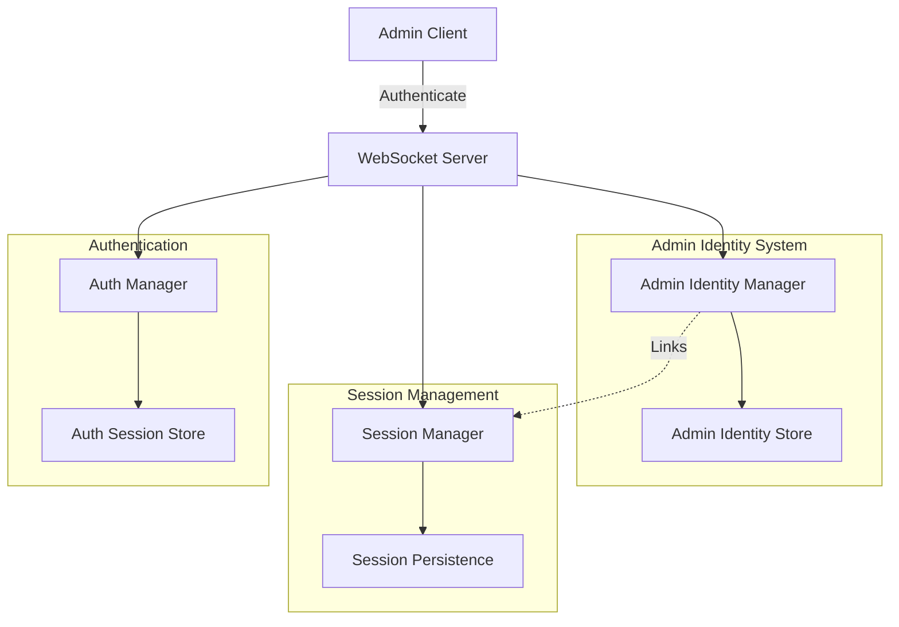
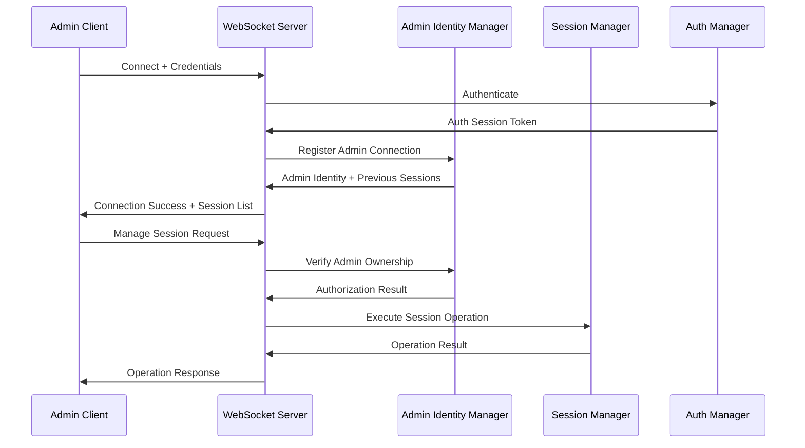

# Design Document

## Overview

This design implements persistent admin authentication for the WebSocket server to solve the issue where admins lose control of their sessions after reconnecting. The solution introduces a persistent admin identity system that separates admin authentication from socket connections, allowing admins to reconnect and regain control of their previously created sessions.

The design extends the existing authentication infrastructure while maintaining backward compatibility and follows the principle of least privilege for session access control.

## Architecture

### High-Level Architecture



### Component Interaction Flow



## Components and Interfaces

### 1. Admin Identity Manager

**Purpose:** Manages persistent admin identities and their relationship to sessions.

**Key Responsibilities:**
- Map authentication sessions to persistent admin identities
- Track admin ownership of sessions
- Handle admin reconnection and session recovery
- Manage concurrent admin connections

**Interface:**
```typescript
interface AdminIdentityManager {
  registerAdminConnection(authSessionId: string, socketId: string): AdminIdentity;
  getAdminIdentity(authSessionId: string): AdminIdentity | null;
  getAdminSessions(adminId: string): SessionData[];
  verifySessionOwnership(adminId: string, sessionId: string): boolean;
  updateAdminSocket(adminId: string, socketId: string): void;
  removeAdminConnection(socketId: string): void;
  getAllAdminSessions(): SessionData[];
}
```

### 2. Enhanced Session Manager

**Purpose:** Extended session manager that tracks admin ownership using persistent identities.

**Key Changes:**
- Replace `adminSocketId` with `adminId` for persistent ownership
- Add `currentAdminSocketId` for current connection tracking
- Implement session ownership verification
- Support read-only access for non-owners

**Interface Extensions:**
```typescript
interface EnhancedSessionData extends SessionData {
  adminId: string;           // Persistent admin identifier
  currentAdminSocketId: string | null;  // Current admin socket
  createdBy: string;         // Admin username for display
}

interface SessionManager {
  // Existing methods...
  createSessionWithAdmin(sessionId: string, config: SessionConfig, adminId: string, adminSocketId: string): SessionData;
  updateCurrentAdminSocket(sessionId: string, adminSocketId: string): boolean;
  verifyAdminAccess(sessionId: string, adminId: string, operation: 'read' | 'write'): boolean;
  getSessionsByAdmin(adminId: string): SessionData[];
}
```

### 3. Admin Identity Store

**Purpose:** Persistent storage for admin identity mappings and session ownership with file-based persistence and lifecycle management.

**Persistence Mechanism:**
- **Storage Type:** JSON file-based persistence in `./admin-identities/` directory
- **File Structure:** One file per admin identity: `{adminId}.json`
- **Backup Strategy:** Atomic writes with temporary files to prevent corruption
- **Index File:** `admin-index.json` for username-to-adminId mapping

**Data Structure:**
```typescript
interface AdminIdentity {
  adminId: string;           // UUID v4 persistent identifier
  username: string;          // Display name (unique)
  createdAt: Date;
  lastSeen: Date;
  activeSockets: Set<string>; // Current socket connections (not persisted)
  ownedSessions: Set<string>; // Sessions created by this admin
  tokenVersion: number;       // For token invalidation
  refreshTokens: Set<string>; // Active refresh tokens
}

interface AdminIdentityStore {
  // Core CRUD operations
  createAdminIdentity(username: string): AdminIdentity;
  getAdminIdentity(adminId: string): AdminIdentity | null;
  getAdminByUsername(username: string): AdminIdentity | null;
  updateLastSeen(adminId: string): void;
  deleteAdminIdentity(adminId: string): boolean;
  
  // Socket management (in-memory only)
  addActiveSocket(adminId: string, socketId: string): void;
  removeActiveSocket(adminId: string, socketId: string): void;
  
  // Session ownership (persisted)
  addOwnedSession(adminId: string, sessionId: string): void;
  removeOwnedSession(adminId: string, sessionId: string): void;
  
  // Token management (persisted)
  addRefreshToken(adminId: string, refreshToken: string): void;
  removeRefreshToken(adminId: string, refreshToken: string): void;
  invalidateAllTokens(adminId: string): void;
  
  // Lifecycle management
  cleanupInactiveIdentities(): void;
  getAllAdminIdentities(): AdminIdentity[];
}
```

**Data Retention and Lifecycle Policy:**
- **Active Admin Retention:** Admin identities are kept indefinitely while they have active sessions
- **Inactive Admin Cleanup:** Admins with no owned sessions and no activity for 90 days are marked for cleanup
- **Cleanup Schedule:** Automated cleanup runs daily at server startup and every 24 hours
- **Orphaned Session Handling:** Sessions owned by deleted admins are reassigned to system admin or marked as orphaned
- **Token Cleanup:** Expired refresh tokens are removed during cleanup cycles

**File Structure Example:**
```
./admin-identities/
├── admin-index.json          # Username to adminId mapping
├── 550e8400-e29b-41d4-a716-446655440000.json  # Admin identity file
├── 6ba7b810-9dad-11d1-80b4-00c04fd430c8.json  # Admin identity file
└── cleanup-log.json          # Cleanup operation log
```

**Persistence Implementation Details:**
- **Atomic Writes:** Use temporary files with rename for atomic updates
- **Error Recovery:** Backup files created before modifications
- **Concurrent Access:** File locking to prevent corruption during concurrent operations
- **Index Consistency:** Username index rebuilt on startup if corrupted
- **Migration Support:** Version field in files for future schema migrations

### 4. Enhanced Authentication Flow

**Purpose:** Integrate admin identity management with existing authentication supporting both credential and token-based authentication.

**Credential-Based Authentication Process:**
1. Client connects and sends username/password
2. AuthManager validates credentials and creates auth session
3. AdminIdentityManager maps auth session to persistent admin identity
4. Server generates JWT token and refresh token
5. Server returns admin identity, tokens, and accessible sessions
6. Subsequent operations use admin identity for authorization

**Token-Based Authentication Process:**
1. Client connects with existing JWT token
2. AuthManager validates token signature and expiry
3. AdminIdentityManager retrieves admin identity from token claims
4. Server returns admin identity and accessible sessions
5. Subsequent operations use admin identity for authorization

**Token Management:**
- JWT tokens expire after configurable time (default: 1 hour)
- Refresh tokens expire after longer period (default: 30 days)
- Server sends expiry warnings 5 minutes before token expiration
- Client can refresh tokens using refresh token
- Expired sessions require full re-authentication

## Data Models

### Admin Identity Model
```typescript
interface AdminIdentity {
  adminId: string;           // UUID v4
  username: string;          // From auth credentials
  createdAt: Date;
  lastSeen: Date;
  activeSockets: Set<string>;
  ownedSessions: Set<string>;
}
```

### Enhanced Session Model
```typescript
interface EnhancedSessionData {
  sessionId: string;
  adminId: string;                    // Persistent admin owner
  currentAdminSocketId: string | null; // Current admin connection
  createdBy: string;                  // Username for display
  config: SessionConfig;
  clients: Map<string, ClientData>;
  createdAt: Date;
  lastActivity: Date;
  status: SessionStatus;
}
```

### Admin Connection Context
```typescript
interface AdminConnectionContext {
  socketId: string;
  adminId: string;
  username: string;
  authSessionId: string;
  connectedAt: Date;
  permissions: {
    canCreateSessions: boolean;
    canViewAllSessions: boolean;
    canManageOwnSessions: boolean;
  };
}
```

## Error Handling

### Authentication Errors
- **Invalid Credentials:** Return clear error message and log attempt
- **Authentication Required:** Reject connection with appropriate message
- **Session Expired:** Force re-authentication and clear admin context

### Authorization Errors
- **Session Not Found:** Return 404 with session ID
- **Access Denied:** Return 403 with ownership information
- **Invalid Operation:** Return 400 with allowed operations

### Connection Errors
- **Admin Identity Conflict:** Handle gracefully by updating socket mapping
- **Orphaned Sessions:** Implement cleanup for sessions with no active admin
- **Concurrent Connection Limits:** Configurable limit with oldest connection eviction

## Testing Strategy

### Unit Tests
1. **AdminIdentityManager Tests**
   - Admin identity creation and retrieval
   - Session ownership verification
   - Socket mapping updates
   - Concurrent connection handling

2. **Enhanced SessionManager Tests**
   - Session creation with admin identity
   - Admin access verification (read/write)
   - Session ownership queries
   - Admin socket updates

3. **Authentication Integration Tests**
   - Admin authentication flow
   - Identity mapping from auth sessions
   - Permission verification
   - Session recovery after reconnection

### Integration Tests
1. **Admin Reconnection Scenarios**
   - Admin disconnects and reconnects
   - Session control recovery
   - Multiple device connections
   - Session state consistency

2. **Multi-Admin Scenarios**
   - Multiple admins with separate sessions
   - Read-only access to other admin sessions
   - Permission boundaries
   - Session isolation

3. **Error Handling Tests**
   - Invalid authentication attempts
   - Unauthorized session access
   - Network disconnection recovery
   - Malformed requests

### End-to-End Tests
1. **Complete Admin Workflow**
   - Admin login → create session → disconnect → reconnect → manage session
   - Multiple admin concurrent operations
   - Session lifecycle with admin changes

2. **Security Validation**
   - Authentication bypass attempts
   - Session hijacking prevention
   - Permission escalation prevention
   - Data isolation verification

## Security Considerations

### Authentication Security
- Secure credential validation using existing AuthManager
- Session token validation for all admin operations
- Configurable session timeouts
- Failed authentication attempt logging

### Authorization Security
- Strict session ownership verification
- Read-only access enforcement for non-owners
- Operation-level permission checking
- Admin identity validation for all operations

### Data Protection
- Admin identities stored securely
- Session ownership data integrity
- Audit logging for admin operations
- Secure cleanup of expired data

### Network Security
- Encrypted WebSocket connections (WSS) support
- Rate limiting for admin operations
- Connection origin validation
- CORS policy enforcement

## Data Model Migration

### Session Data Cleanup
- Remove `adminSocketId` field from SessionData interface
- Replace with `adminId` and `currentAdminSocketId` fields
- Update all session persistence files to new format
- Clean up any existing session files with old format

### Type System Updates
- Update shared types in `src/shared/types.ts` to reflect new admin model
- Ensure Capture Electron App uses updated types
- Remove deprecated socket-based admin identification
- Add new admin authentication message types

## Capture Electron App Integration

### Authentication Flow Updates
The Capture Electron App needs to be updated to support the new admin authentication:

1. **Login Screen Enhancement**
   - Add admin credential input fields (username/password)
   - Implement authentication handshake with WebSocket server
   - Store admin identity for session management
   - Handle authentication errors gracefully

2. **Session Management Updates**
   - Use admin identity instead of socket ID for session operations
   - Update session creation to include admin credentials
   - Implement session recovery after reconnection
   - Display admin ownership information in UI

3. **WebSocket Message Updates**
   - Add admin authentication messages to protocol
   - Update session management messages to use admin identity
   - Implement admin identity validation responses
   - Add session ownership indicators

## Admin Message Protocol Specification

### Authentication Messages

#### 1. Admin Authentication Request
**Direction:** Electron App → WebSocket Server  
**Trigger:** When admin attempts to connect/login
```typescript
interface AdminAuthMessage {
  type: 'admin-auth';
  method: 'credentials' | 'token';
  // For credentials method
  username?: string;
  password?: string;
  // For token method
  token?: string;
  clientInfo?: {
    appVersion: string;
    platform: string;
    deviceId: string;
  };
}
```

#### 2. Admin Authentication Response
**Direction:** WebSocket Server → Electron App  
**Trigger:** Response to admin authentication request
```typescript
interface AdminAuthResponse {
  type: 'admin-auth-response';
  success: boolean;
  adminId?: string;
  username?: string;
  // JWT token for future authentication
  token?: string;
  tokenExpiry?: string; // ISO timestamp
  refreshToken?: string;
  ownedSessions?: SessionSummary[];
  allSessions?: SessionSummary[];
  permissions?: AdminPermissions;
  error?: string;
  timestamp: string;
}

interface SessionSummary {
  sessionId: string;
  status: SessionStatus;
  clientCount: number;
  createdAt: string;
  createdBy: string;
  isOwner: boolean;
  config: {
    enabledLanguages: TargetLanguage[];
    ttsMode: string;
  };
}

interface AdminPermissions {
  canCreateSessions: boolean;
  canViewAllSessions: boolean;
  canManageOwnSessions: boolean;
  canDeleteOwnSessions: boolean;
}
```

### Session Management Messages

#### 3. Start Session Request
**Direction:** Electron App → WebSocket Server  
**Trigger:** When admin creates a new session
```typescript
interface StartSessionMessage {
  type: 'start-session';
  sessionId: string;
  config: SessionConfig;
  // adminId is derived from authenticated connection
}
```

#### 4. Start Session Response
**Direction:** WebSocket Server → Electron App  
**Trigger:** Response to session creation
```typescript
interface StartSessionResponse {
  type: 'start-session-response';
  success: boolean;
  sessionId?: string;
  adminId?: string;
  config?: SessionConfig;
  error?: string;
  timestamp: string;
}
```

#### 5. End Session Request
**Direction:** Electron App → WebSocket Server  
**Trigger:** When admin ends a session
```typescript
interface EndSessionMessage {
  type: 'end-session';
  sessionId: string;
  reason?: string;
}
```

#### 6. End Session Response
**Direction:** WebSocket Server → Electron App  
**Trigger:** Response to session end request
```typescript
interface EndSessionResponse {
  type: 'end-session-response';
  success: boolean;
  sessionId: string;
  error?: string;
  timestamp: string;
}
```

#### 7. List Sessions Request
**Direction:** Electron App → WebSocket Server  
**Trigger:** When admin requests session list refresh
```typescript
interface ListSessionsMessage {
  type: 'list-sessions';
  filter?: 'owned' | 'all';
}
```

#### 8. List Sessions Response
**Direction:** WebSocket Server → Electron App  
**Trigger:** Response to session list request
```typescript
interface ListSessionsResponse {
  type: 'list-sessions-response';
  sessions: SessionSummary[];
  timestamp: string;
}
```

### Session Configuration Messages

#### 9. Update Session Config Request
**Direction:** Electron App → WebSocket Server  
**Trigger:** When admin modifies session settings
```typescript
interface UpdateSessionConfigMessage {
  type: 'update-session-config';
  sessionId: string;
  config: Partial<SessionConfig>;
}
```

#### 10. Update Session Config Response
**Direction:** WebSocket Server → Electron App  
**Trigger:** Response to config update
```typescript
interface UpdateSessionConfigResponse {
  type: 'update-session-config-response';
  success: boolean;
  sessionId: string;
  config?: SessionConfig;
  error?: string;
  timestamp: string;
}
```

#### 11. Session Status Update (Broadcast)
**Direction:** WebSocket Server → Electron App  
**Trigger:** When session status changes (clients join/leave, config changes)
```typescript
interface SessionStatusUpdate {
  type: 'session-status-update';
  sessionId: string;
  status: SessionStatus;
  clientCount: number;
  config: SessionConfig;
  lastActivity: string;
  isOwner: boolean;
}
```

### Admin Management Messages

#### 12. Admin Reconnection Notification
**Direction:** WebSocket Server → Electron App  
**Trigger:** When admin reconnects and recovers sessions
```typescript
interface AdminReconnectionNotification {
  type: 'admin-reconnection';
  adminId: string;
  username: string;
  recoveredSessions: string[];
  timestamp: string;
}
```

#### 13. Admin Session Access Request
**Direction:** Electron App → WebSocket Server  
**Trigger:** When admin tries to access/view another admin's session
```typescript
interface AdminSessionAccessMessage {
  type: 'admin-session-access';
  sessionId: string;
  accessType: 'read' | 'write';
}
```

#### 14. Admin Session Access Response
**Direction:** WebSocket Server → Electron App  
**Trigger:** Response to session access request
```typescript
interface AdminSessionAccessResponse {
  type: 'admin-session-access-response';
  success: boolean;
  sessionId: string;
  accessType: 'read' | 'write';
  sessionData?: SessionData;
  error?: string;
  timestamp: string;
}
```

### Error and Status Messages

#### 15. Admin Error Notification
**Direction:** WebSocket Server → Electron App  
**Trigger:** When admin-specific errors occur
```typescript
interface AdminErrorMessage {
  type: 'admin-error';
  errorCode: AdminErrorCode;
  message: string;
  userMessage: string;        // User-friendly message for UI display
  retryable: boolean;         // Whether operation can be retried
  retryAfter?: number;        // Seconds to wait before retry (if retryable)
  details?: {
    sessionId?: string;
    operation?: string;
    adminId?: string;
    validationErrors?: string[];
  };
  timestamp: string;
}

// Error Code Enumeration
enum AdminErrorCode {
  // Authentication Errors (1000-1099)
  AUTH_INVALID_CREDENTIALS = 'AUTH_1001',
  AUTH_TOKEN_EXPIRED = 'AUTH_1002',
  AUTH_TOKEN_INVALID = 'AUTH_1003',
  AUTH_REFRESH_TOKEN_EXPIRED = 'AUTH_1004',
  AUTH_REFRESH_TOKEN_INVALID = 'AUTH_1005',
  AUTH_SESSION_NOT_FOUND = 'AUTH_1006',
  AUTH_RATE_LIMITED = 'AUTH_1007',
  AUTH_ACCOUNT_LOCKED = 'AUTH_1008',
  
  // Authorization Errors (1100-1199)
  AUTHZ_ACCESS_DENIED = 'AUTHZ_1101',
  AUTHZ_SESSION_NOT_OWNED = 'AUTHZ_1102',
  AUTHZ_INSUFFICIENT_PERMISSIONS = 'AUTHZ_1103',
  AUTHZ_OPERATION_NOT_ALLOWED = 'AUTHZ_1104',
  
  // Session Management Errors (1200-1299)
  SESSION_NOT_FOUND = 'SESSION_1201',
  SESSION_ALREADY_EXISTS = 'SESSION_1202',
  SESSION_INVALID_CONFIG = 'SESSION_1203',
  SESSION_CREATION_FAILED = 'SESSION_1204',
  SESSION_UPDATE_FAILED = 'SESSION_1205',
  SESSION_DELETE_FAILED = 'SESSION_1206',
  SESSION_CLIENT_LIMIT_EXCEEDED = 'SESSION_1207',
  
  // Admin Identity Errors (1300-1399)
  ADMIN_IDENTITY_NOT_FOUND = 'ADMIN_1301',
  ADMIN_IDENTITY_CREATION_FAILED = 'ADMIN_1302',
  ADMIN_USERNAME_TAKEN = 'ADMIN_1303',
  ADMIN_IDENTITY_CORRUPTED = 'ADMIN_1304',
  
  // System Errors (1400-1499)
  SYSTEM_INTERNAL_ERROR = 'SYSTEM_1401',
  SYSTEM_DATABASE_ERROR = 'SYSTEM_1402',
  SYSTEM_NETWORK_ERROR = 'SYSTEM_1403',
  SYSTEM_RATE_LIMITED = 'SYSTEM_1404',
  SYSTEM_MAINTENANCE_MODE = 'SYSTEM_1405',
  SYSTEM_CONNECTION_LIMIT_EXCEEDED = 'SYSTEM_1406',
  
  // Validation Errors (1500-1599)
  VALIDATION_INVALID_INPUT = 'VALIDATION_1501',
  VALIDATION_MISSING_REQUIRED_FIELD = 'VALIDATION_1502',
  VALIDATION_INVALID_SESSION_ID = 'VALIDATION_1503',
  VALIDATION_INVALID_LANGUAGE = 'VALIDATION_1504',
  VALIDATION_INVALID_CONFIG = 'VALIDATION_1505'
}

// Error Code to User Message Mapping
const ERROR_MESSAGES: Record<AdminErrorCode, { message: string; userMessage: string; retryable: boolean; retryAfter?: number }> = {
  [AdminErrorCode.AUTH_INVALID_CREDENTIALS]: {
    message: 'Invalid username or password provided',
    userMessage: 'Invalid username or password. Please check your credentials and try again.',
    retryable: true
  },
  [AdminErrorCode.AUTH_TOKEN_EXPIRED]: {
    message: 'Authentication token has expired',
    userMessage: 'Your session has expired. Please log in again.',
    retryable: true
  },
  [AdminErrorCode.AUTH_TOKEN_INVALID]: {
    message: 'Authentication token is invalid or malformed',
    userMessage: 'Authentication error. Please log in again.',
    retryable: true
  },
  [AdminErrorCode.AUTH_RATE_LIMITED]: {
    message: 'Too many authentication attempts',
    userMessage: 'Too many login attempts. Please wait before trying again.',
    retryable: true,
    retryAfter: 300 // 5 minutes
  },
  [AdminErrorCode.AUTHZ_SESSION_NOT_OWNED]: {
    message: 'Admin does not own the specified session',
    userMessage: 'You can only manage sessions that you created.',
    retryable: false
  },
  [AdminErrorCode.SESSION_NOT_FOUND]: {
    message: 'Specified session does not exist',
    userMessage: 'Session not found. It may have been deleted or expired.',
    retryable: false
  },
  [AdminErrorCode.SESSION_ALREADY_EXISTS]: {
    message: 'Session with this ID already exists',
    userMessage: 'A session with this ID already exists. Please choose a different ID.',
    retryable: true
  },
  [AdminErrorCode.SYSTEM_INTERNAL_ERROR]: {
    message: 'Internal server error occurred',
    userMessage: 'An unexpected error occurred. Please try again later.',
    retryable: true,
    retryAfter: 30
  }
  // ... (additional mappings for all error codes)
};
```

#### 16. Admin Status Update
**Direction:** WebSocket Server → Electron App  
**Trigger:** Periodic status updates or on significant events
```typescript
interface AdminStatusUpdate {
  type: 'admin-status-update';
  adminId: string;
  activeConnections: number;
  ownedSessions: number;
  totalSessions: number;
  lastActivity: string;
  permissions: AdminPermissions;
}
```

### Token Management Messages

#### 17. Token Refresh Request
**Direction:** Electron App → WebSocket Server  
**Trigger:** When token is about to expire or has expired
```typescript
interface TokenRefreshMessage {
  type: 'token-refresh';
  refreshToken: string;
  adminId: string;
}
```

#### 18. Token Refresh Response
**Direction:** WebSocket Server → Electron App  
**Trigger:** Response to token refresh request
```typescript
interface TokenRefreshResponse {
  type: 'token-refresh-response';
  success: boolean;
  token?: string;
  tokenExpiry?: string;
  refreshToken?: string;
  error?: string;
  timestamp: string;
}
```

#### 19. Token Expiry Warning
**Direction:** WebSocket Server → Electron App  
**Trigger:** When token is about to expire (5 minutes before)
```typescript
interface TokenExpiryWarning {
  type: 'token-expiry-warning';
  adminId: string;
  expiresAt: string;
  timeRemaining: number; // seconds
  timestamp: string;
}
```

#### 20. Session Expired Notification
**Direction:** WebSocket Server → Electron App  
**Trigger:** When token has expired and admin needs to re-authenticate
```typescript
interface SessionExpiredNotification {
  type: 'session-expired';
  adminId: string;
  reason: 'token-expired' | 'invalid-token' | 'revoked';
  timestamp: string;
}
```

### Message Flow Examples

#### Initial Authentication Flow (Credentials)
```
1. Electron App → WS: AdminAuthMessage (method: 'credentials', username, password)
2. WS → Electron App: AdminAuthResponse (success + token + session list)
3. WS → Electron App: AdminStatusUpdate (initial status)
```

#### Reconnection Authentication Flow (Token)
```
1. Electron App → WS: AdminAuthMessage (method: 'token', token)
2. WS → Electron App: AdminAuthResponse (success + session list)
3. WS → Electron App: AdminReconnectionNotification
```

#### Token Refresh Flow
```
1. WS → Electron App: TokenExpiryWarning (5 minutes before expiry)
2. Electron App → WS: TokenRefreshMessage (refreshToken)
3. WS → Electron App: TokenRefreshResponse (new token + refreshToken)
```

#### Session Expiry Flow
```
1. WS → Electron App: SessionExpiredNotification (token expired)
2. Electron App → WS: AdminAuthMessage (method: 'credentials', username, password)
3. WS → Electron App: AdminAuthResponse (new token + session recovery)
```

### Error Handling and Retry Strategies

#### Client-Side Retry Logic
```typescript
interface RetryStrategy {
  maxAttempts: number;
  baseDelay: number;        // milliseconds
  maxDelay: number;         // milliseconds
  backoffMultiplier: number;
  retryableErrors: AdminErrorCode[];
}

const DEFAULT_RETRY_STRATEGY: RetryStrategy = {
  maxAttempts: 3,
  baseDelay: 1000,          // 1 second
  maxDelay: 30000,          // 30 seconds
  backoffMultiplier: 2,
  retryableErrors: [
    AdminErrorCode.SYSTEM_INTERNAL_ERROR,
    AdminErrorCode.SYSTEM_NETWORK_ERROR,
    AdminErrorCode.AUTH_TOKEN_EXPIRED,
    AdminErrorCode.SESSION_CREATION_FAILED,
    AdminErrorCode.SESSION_UPDATE_FAILED
  ]
};
```

#### Automatic Recovery Scenarios
1. **Token Expiry Recovery:**
   - Detect token expiry error
   - Attempt automatic refresh using refresh token
   - If refresh fails, prompt for re-authentication
   - Retry original operation after successful auth

2. **Network Disconnection Recovery:**
   - Detect WebSocket disconnection
   - Attempt reconnection with exponential backoff
   - Use token-based authentication for reconnection
   - Recover admin session state and owned sessions

3. **Session State Recovery:**
   - On reconnection, request current session list
   - Compare with local session state
   - Update UI to reflect current server state
   - Notify user of any session changes

#### Error Display Guidelines
- **Transient Errors:** Show toast notification with retry option
- **Authentication Errors:** Redirect to login screen with error message
- **Permission Errors:** Show modal dialog explaining access restrictions
- **System Errors:** Show error banner with retry button and support contact

#### Session Creation Flow
```
1. Electron App → WS: StartSessionMessage
2. WS → Electron App: StartSessionResponse (success)
3. WS → Electron App: SessionStatusUpdate (new session status)
4. WS → All Admins: SessionStatusUpdate (broadcast new session)
```

#### Reconnection Flow
```
1. Electron App → WS: AdminAuthMessage (after disconnect)
2. WS → Electron App: AdminAuthResponse (with recovered sessions)
3. WS → Electron App: AdminReconnectionNotification
4. WS → Electron App: SessionStatusUpdate (for each recovered session)
```

### UI/UX Updates for Capture App
- Add admin login form before main interface
- Show admin identity in header/status bar
- Display session ownership indicators
- Add "My Sessions" vs "All Sessions" views
- Show read-only indicators for other admin sessions
##
 Security Specifications

### JWT Secret Management
```typescript
interface JWTConfig {
  secret: string;           // Generated on first run, stored in .env
  algorithm: 'HS256';       // HMAC SHA-256
  issuer: 'service-translate-ws';
  audience: 'service-translate-admin';
  rotationPolicy: {
    enabled: boolean;
    intervalDays: number;   // Default: 90 days
  };
}

// JWT Secret Generation and Storage
// 1. On first startup, generate 256-bit random secret
// 2. Store in .env file with restricted permissions (600)
// 3. Backup secret to secure location for disaster recovery
// 4. Rotate secret every 90 days (configurable)
// 5. If secret compromised: invalidate all tokens, force re-auth

// System Admin Setup (created automatically on first startup):
interface SystemAdminConfig {
  username: 'system';
  adminId: 'system';
  permissions: {
    canCreateSessions: false;      // System admin cannot create sessions
    canViewAllSessions: true;      // Can view all sessions for monitoring
    canManageOwnSessions: false;   // Has no owned sessions
    canManageOrphanedSessions: true; // Special permission for orphaned sessions
  };
  // System admin:
  // 1. Created automatically on first server startup
  // 2. Cannot be deleted or modified by users
  // 3. Used only for orphaned session management and system operations
  // 4. Does not require authentication (internal use only)
  // 5. Not exposed in admin lists or UI
}
```

### File Locking Implementation
```typescript
// Use 'proper-lockfile' npm package for cross-platform file locking
import lockfile from 'proper-lockfile';

const lockOptions = {
  stale: 10000,        // 10 seconds - consider lock stale after this
  retries: 3,          // Retry 3 times before failing
  realpath: false,     // Don't resolve symlinks
  onCompromised: (err) => {
    console.error('Lock compromised:', err);
    // Reload data from disk and retry operation
  }
};

// Lock acquisition failure handling:
// 1. Log warning with operation details
// 2. Return error to client with retry-after header
// 3. Client implements exponential backoff retry
```

### Token Storage Security (Electron App)
```typescript
// Use Electron's safeStorage API for secure token storage
import { safeStorage } from 'electron';

interface SecureTokenStorage {
  storeTokens(tokens: { accessToken: string; refreshToken: string }): void;
  retrieveTokens(): { accessToken: string; refreshToken: string } | null;
  clearTokens(): void;
  isEncryptionAvailable(): boolean;
}

// Implementation:
// 1. Check if safeStorage.isEncryptionAvailable()
// 2. If available: encrypt tokens before storing in userData
// 3. If not available: store in secure keychain/credential manager
// 4. Fallback: encrypted file with machine-specific key
// 5. Clear tokens on logout and app exit
```

### Rate Limiting Configuration
```typescript
interface AdminRateLimitConfig {
  authentication: {
    maxAttempts: 5;           // Per username
    windowMinutes: 15;        // Rolling window
    lockoutMinutes: 30;       // After max attempts exceeded
    whitelistedIPs: string[]; // Bypass rate limiting
  };
  operations: {
    maxOperationsPerMinute: 60;  // Per admin identity
    burstLimit: 10;             // Allow burst of operations
  };
  connection: {
    maxConnectionsPerIP: 5;     // Prevent connection flooding
    maxConnectionsPerAdmin: 3;  // Multiple device limit
    connectionLimitAction: 'reject' | 'disconnect-oldest'; // What to do when limit reached
  };
}

// Rate limiting implementation:
// 1. Track attempts by username (not IP to allow mobile/VPN users)
// 2. Use sliding window algorithm
// 3. Store rate limit data in memory (reset on server restart)
// 4. Log rate limit violations for security monitoring

// When connection limit reached:
// 1. If action is 'reject': Return error code SYSTEM_1406 with message
// 2. If action is 'disconnect-oldest': Close oldest connection for same admin
// 3. Log connection limit event for monitoring
// 4. Suggest closing inactive connections in error message
```

### Orphaned Session Policy
```typescript
interface OrphanedSessionPolicy {
  action: 'mark-orphaned';     // Mark as orphaned, don't delete
  gracePeriodDays: 7;          // Days before cleanup
  systemAdminId: 'system';     // Reserved admin ID for system operations
  recoveryEnabled: true;       // Allow manual recovery by new admin
}

// Orphaned session handling:
// 1. When admin identity is deleted, mark sessions as orphaned
// 2. Orphaned sessions remain read-only for grace period
// 3. After grace period, sessions are automatically ended
// 4. System admin can reassign orphaned sessions to new admin
// 5. Audit log tracks all orphaned session operations
```

### Session Status Update Triggers
```typescript
// SessionStatusUpdate broadcast triggers (throttled to max 1/second per session):
enum SessionUpdateTrigger {
  CLIENT_JOINED = 'client-joined',           // Client joins session
  CLIENT_LEFT = 'client-left',               // Client leaves session  
  CONFIG_UPDATED = 'config-updated',         // Session config changed
  STATUS_CHANGED = 'status-changed',         // Session status changed
  ADMIN_RECONNECTED = 'admin-reconnected',   // Admin socket updated
  TTS_MODE_CHANGED = 'tts-mode-changed',     // TTS configuration changed
  LANGUAGE_UPDATED = 'language-updated'      // Enabled languages changed
}

// Throttling implementation:
// 1. Queue updates per session with latest state
// 2. Send batched update every 1 second maximum
// 3. Immediate send for critical updates (session ended)
// 4. Include trigger reason in update message
```

### Security Considerations

#### Authentication Security
- Secure credential validation using existing AuthManager
- JWT token validation with signature verification for all admin operations
- Configurable session timeouts (default: 1 hour access, 30 days refresh)
- Failed authentication attempt logging with IP and timestamp
- Automatic account lockout after repeated failures

#### Authorization Security
- Strict session ownership verification using persistent admin identity
- Read-only access enforcement for non-owners with clear UI indicators
- Operation-level permission checking before execution
- Admin identity validation for all operations using JWT claims

#### Data Protection
- Admin identities stored with file permissions 600 (owner read/write only)
- Session ownership data integrity with atomic file operations
- Comprehensive audit logging for admin operations
- Secure cleanup of expired data with overwrite deletion

#### Network Security
- Encrypted WebSocket connections (WSS) support required for production
- Rate limiting for admin operations with exponential backoff
- Connection origin validation with configurable whitelist
- CORS policy enforcement for web-based admin interfaces