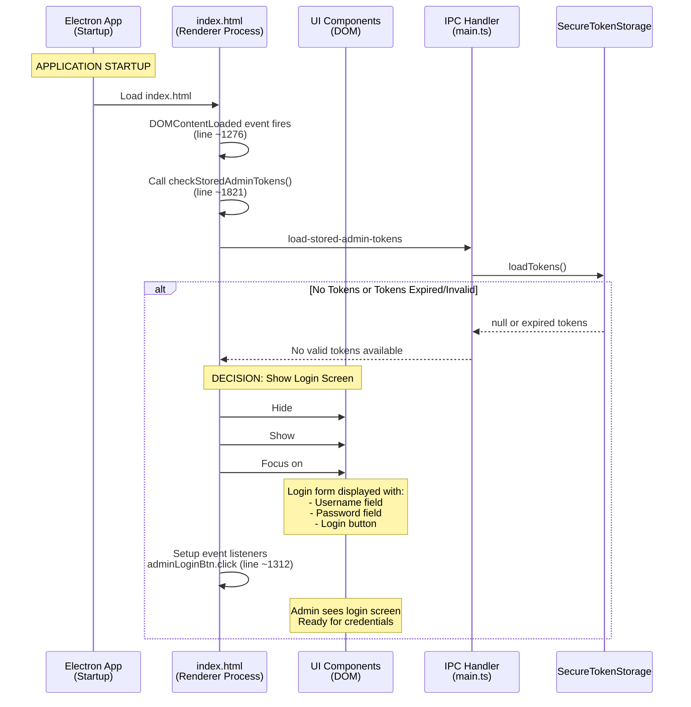
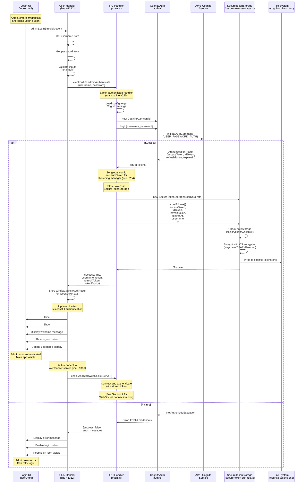
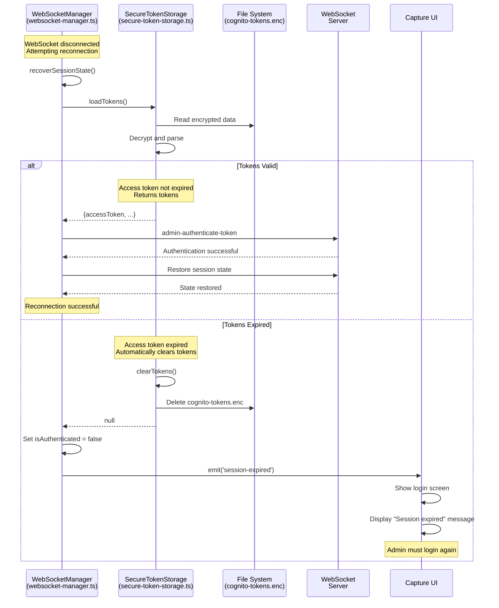
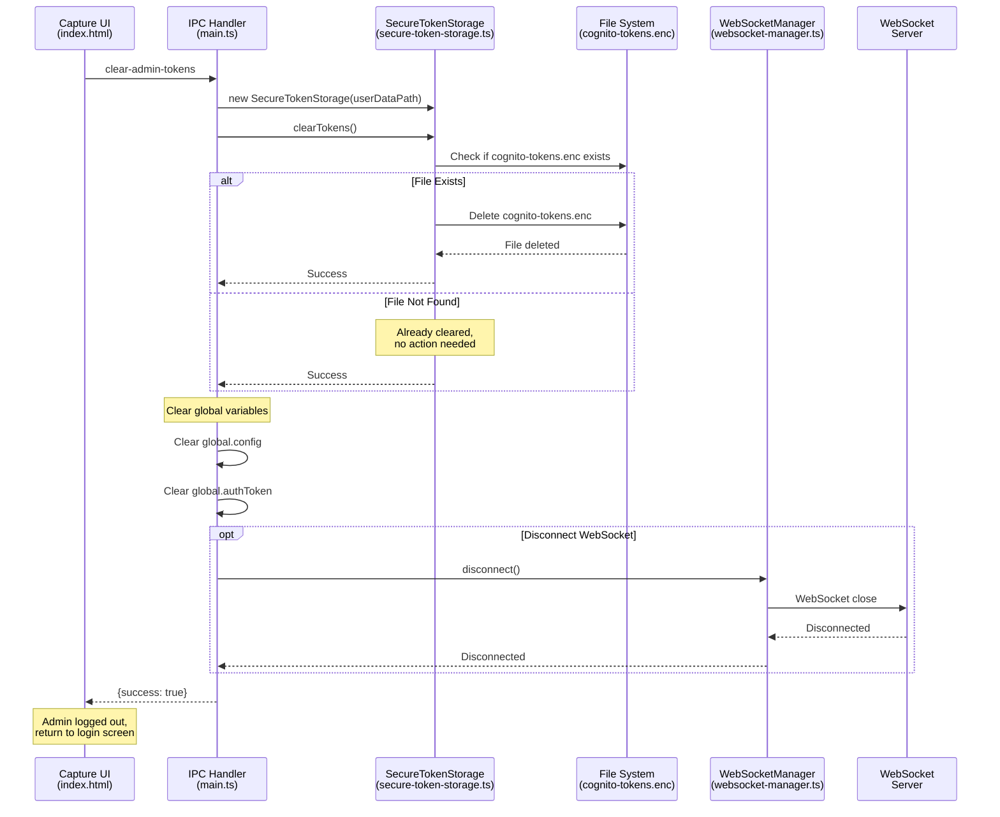
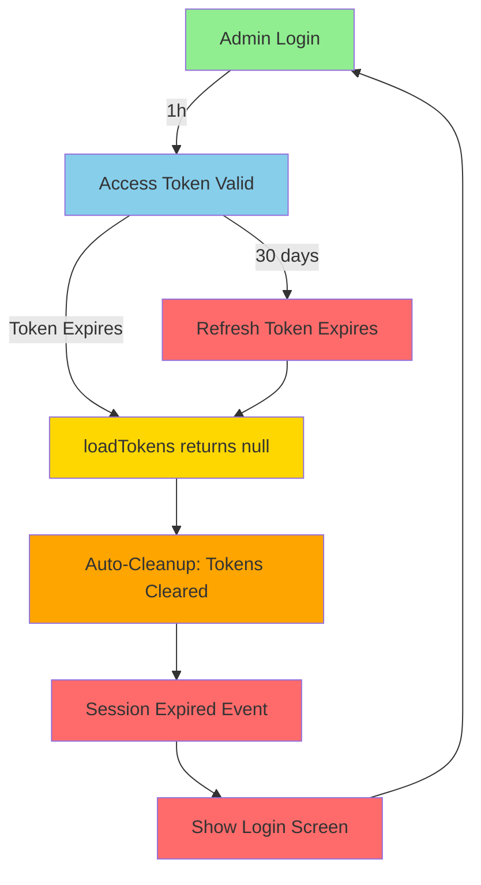
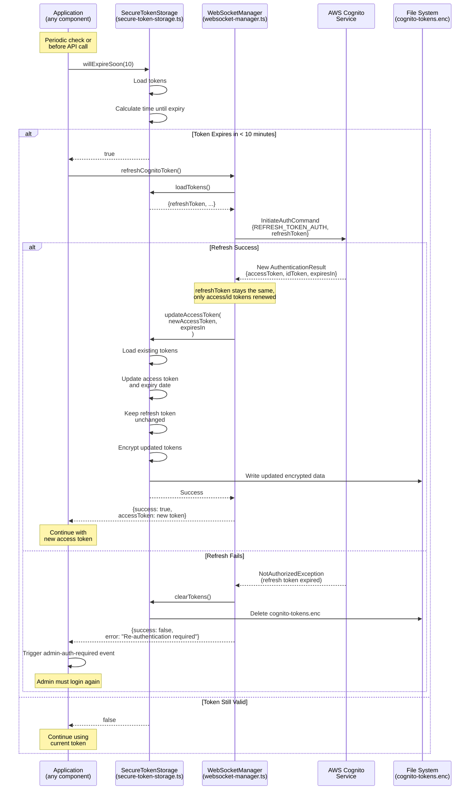
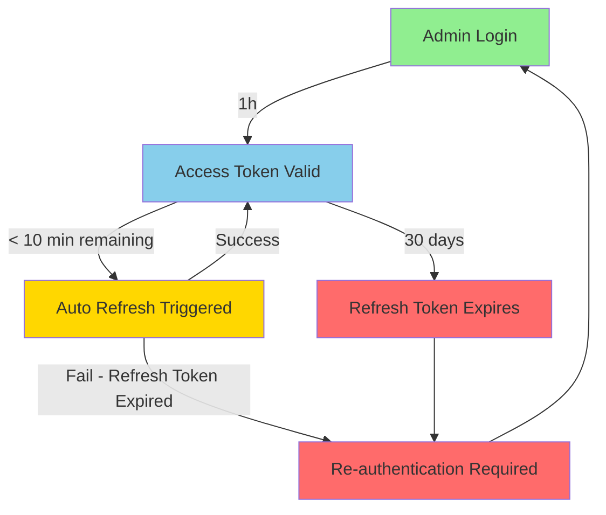

# Authentication Flow Sequence Diagrams

This document describes the complete authentication workflows for the service-translate application using AWS Cognito authentication system (v2.0.0+).

## Overview

The application uses AWS Cognito for admin authentication with the following components:
- **Access Token**: Valid for 1 hour, used for API authentication
- **ID Token**: Valid for 1 hour, used for AWS Identity Pool
- **Refresh Token**: Valid for 30 days, used to obtain new access tokens
- **Storage**: Encrypted local storage using OS-level encryption (cognito-tokens.enc)

**Important**: Only admin authentication is supported. All legacy authentication code has been removed as of v2.0.0+.

---

## 1. Admin Login Flow

This flow occurs when an admin manually enters credentials to authenticate. This typically follows from the startup sequence (Section 2) when no valid tokens are found or when tokens have expired beyond the 30-day refresh limit.

### From Startup to Login Screen



### Admin Login Authentication

This continues from the login screen shown above when the admin clicks the login button.



**Key Points:**
- **UI Flow**: Application startup → No tokens → Show login screen → Admin input → Login button click
- **Token Storage**: Tokens stored in encrypted `cognito-tokens.enc` via SecureTokenStorage (line ~284 in main.ts)
- **Event Handler**: Login button click handler at line ~1312 in index.html
- **Credentials**: Never stored locally, only encrypted tokens
- **OS-level Encryption**: Keychain (macOS), DPAPI (Windows), libsecret (Linux)
- **Post-Login**: Automatic WebSocket connection and session list retrieval
- **Global State**: Sets global config and authToken for streaming manager
- **IPC Handlers**: Uses `admin-authenticate`, not legacy `login` handler

---

## 2. Auto-Login Flow (Startup) - OPTIMIZED

This flow begins when the Electron application starts and shows the complete UI decision flow - whether to display the login screen or proceed directly to the main application with auto-authentication. The optimized flow validates credentials BEFORE connecting to the WebSocket server (fail-fast approach).

**v2.1.0+ Enhancement**: `loadTokens()` is now authoritative - it automatically clears expired tokens and returns null. This eliminates the need for callers to check token expiration separately, making the startup flow even simpler and more reliable.

```mermaid
sequenceDiagram
    participant Electron as Electron App<br/>(Startup)
    participant HTML as index.html<br/>(Renderer Process)
    participant UI as UI Components<br/>(DOM)
    participant IPC as IPC Handler<br/>(main.ts)
    participant Storage as SecureTokenStorage<br/>(secure-token-storage.ts)
    participant FS as File System<br/>(cognito-tokens.enc)
    participant Auth as CognitoAuth<br/>(auth.ts)
    participant Cognito as AWS Cognito<br/>Service
    participant WS as WebSocketManager<br/>(websocket-manager.ts)
    participant Server as WebSocket<br/>Server

    Note over Electron: APPLICATION STARTUP
    
    Electron->>HTML: Load index.html
    HTML->>HTML: DOMContentLoaded event fires
    
    Note over HTML: Check for stored credentials<br/>before showing any UI
    
    HTML->>IPC: checkStoredAdminTokens()
    IPC->>Storage: new SecureTokenStorage(userDataPath)
    IPC->>Storage: hasStoredTokens()
    
    Storage->>FS: Check if cognito-tokens.enc exists
    
    alt No Stored Tokens Found
        FS-->>Storage: File not found
        Storage-->>IPC: false
        IPC-->>HTML: No tokens available
        
        Note over HTML,UI: SHOW LOGIN SCREEN
        
        HTML->>UI: Hide main-app div
        HTML->>UI: Show login-panel div
        HTML->>UI: Setup login form listeners
        
        Note over UI: Admin sees login form<br/>and must authenticate manually
        
        Note over UI: (Admin Login Flow continues<br/>from Section 1)
        
    else Stored Tokens Found
        FS-->>Storage: File exists
        Storage-->>IPC: true
        
        IPC->>Storage: loadTokens()
        
        Storage->>FS: Read encrypted data
        FS-->>Storage: Encrypted token data
        
        Storage->>Storage: Decrypt using OS decryption
        Storage->>Storage: Parse JSON and validate
        
        alt Tokens Valid (Not Expired)
            Note over Storage: Access token not expired<br/>Returns tokens immediately
            
            Storage-->>IPC: {accessToken, idToken, refreshToken, ...}
            
            IPC-->>HTML: {success: true, tokens, username}
            
            Note over HTML,UI: AUTO-LOGIN SUCCESS<br/>SHOW MAIN APP
            
            HTML->>UI: Hide login-panel div
            HTML->>UI: Show main-app div
            HTML->>UI: Show logout button
            HTML->>UI: Display welcome message
            
            Note over UI: Admin sees main app immediately<br/>No login form displayed
            
            HTML->>IPC: checkAndStartWebSocketServer()
            
            Note over IPC: Verify WebSocket server status
            
            IPC->>Server: HTTP health check
            
            alt Server Already Running
                Server-->>IPC: Health check OK
                
                Note over IPC: STEP 1: Tokens validated ✓<br/>STEP 2: Initialize WebSocket
                
                IPC->>WS: new WebSocketManager(config)
                
                Note over IPC: STEP 3: Connect to WebSocket
                
                IPC->>WS: connect()
                WS->>Server: WebSocket connection
                Server-->>WS: Connected
                
                Note over IPC: STEP 4: Authenticate immediately<br/>with stored token
                
                IPC->>WS: adminAuthenticateWithToken(accessToken)
                WS->>Server: admin-authenticate-token
                Server-->>WS: Authentication successful
                
                WS->>Server: list-sessions
                Server-->>WS: Sessions list
                
                WS-->>IPC: Connected & Authenticated
                IPC-->>HTML: Update UI with sessions
                HTML->>UI: Display active sessions
                HTML->>UI: Enable session controls
                
                Note over UI: Admin is auto-authenticated<br/>and sees active sessions
                
            else Server Not Running
                Server-->>IPC: Health check failed
                
                Note over IPC: Start WebSocket server
                
                IPC->>Server: Start server process
                Server-->>IPC: Server started
                
                Note over IPC: Wait for server ready (3s)
                
                IPC->>WS: new WebSocketManager(config)
                IPC->>WS: connect()
                WS->>Server: WebSocket connection
                Server-->>WS: Connected
                
                IPC->>WS: adminAuthenticateWithToken(accessToken)
                WS->>Server: admin-authenticate-token
                Server-->>WS: Authentication successful
                
                WS->>Server: list-sessions
                Server-->>WS: Sessions list
                
                WS-->>IPC: Connected & Authenticated
                IPC-->>HTML: Update UI
                HTML->>UI: Display active sessions
                
                Note over UI: Admin auto-authenticated<br/>after server startup
            end
            
        else Tokens Expired
            Note over Storage: Access token expired<br/>Automatically clears tokens
            
            Storage->>Storage: clearTokens()
            Storage->>FS: Delete cognito-tokens.enc
            Storage-->>IPC: null
            
            IPC-->>HTML: {success: false, reason: "expired"}
            
            Note over HTML,UI: TOKENS EXPIRED<br/>SHOW LOGIN SCREEN
            
            HTML->>UI: Hide main-app
            HTML->>UI: Show login-panel
            HTML->>UI: Display "Session expired" message
            
            Note over UI: Admin must login again<br/>(tokens cleared automatically)
        end
    end
```



**Key Points:**
- **Fail-Fast Optimization**: Validates credentials BEFORE connecting to WebSocket (main.ts lines ~371-469)
- **Authoritative loadTokens() (v2.1.0+)**: Returns null for expired tokens, automatically clearing them
- **Simplified Logic**: Callers don't need to check expiration - just test for null
- **Network Efficiency**: Avoids unnecessary WebSocket connection if credentials invalid/missing
- **Graceful Degradation**: Clear error messages when tokens expired
- **Immediate Authentication**: Once connected, authenticates immediately (no delay)
- **Global State Management**: Sets global config and authToken for streaming manager after validation
- **IPC Handlers**: Uses `load-stored-admin-tokens`, not legacy `checkStoredCredentials`

---

## 3. Token Refresh Flow (Manual Retry on Reconnection)

This flow occurs when the WebSocket connection drops and needs to re-authenticate during reconnection. Since `loadTokens()` automatically clears expired tokens (v2.1.0+), the reconnection logic is simplified.



**Key Points:**
- **Simplified Reconnection**: No separate expiration check needed
- **Automatic Cleanup**: `loadTokens()` clears expired tokens immediately
- **Clear User Feedback**: Session-expired event shows login screen
- **No Manual Refresh**: If tokens expired, full re-login required
- **Fail-Fast**: Doesn't attempt WebSocket auth with expired tokens

---

## 4. Admin Logout Flow

This flow occurs when an admin explicitly logs out of the application.



**Key Points:**
- Complete cleanup of stored credentials
- Global variables cleared to prevent unauthorized access
- WebSocket disconnection optional but recommended
- File deletion errors don't fail the logout process
- **IPC Handler**: Uses `clear-admin-tokens`, not legacy `logout` handler

---

## 5. Token Refresh Flow (Background Refresh - Not Implemented)

**Note**: As of v2.1.0+, automatic background token refresh is NOT implemented. The application relies on:

1. **Initial Token Validity**: Tokens are validated at startup via `loadTokens()`
2. **1-Hour Token Lifetime**: Access tokens valid for 1 hour
3. **Session Duration**: Most admin sessions complete within 1 hour
4. **Re-authentication Required**: If tokens expire during use, admin must login again

**Design Decision**: Implementing automatic refresh adds complexity without significant benefit for typical usage patterns. The simplified approach:
- ✅ Validates tokens immediately on startup
- ✅ Clears expired tokens automatically
- ✅ Provides clear feedback when re-authentication needed
- ❌ Does not implement background refresh timers
- ❌ Does not automatically refresh near-expiry tokens

**Future Enhancement**: If longer sessions become common, background refresh can be implemented by:
1. Checking `tokenStorage.willExpireSoon(10)` every 5 minutes
2. Calling `websocketManager.refreshCognitoToken()` when needed
3. Updating stored tokens with `tokenStorage.updateAccessToken()`

---

## Token Lifecycle Summary



**Token Expiry Timeline:**
- **Access Token**: 1 hour (no automatic refresh in v2.1.0+)
- **ID Token**: 1 hour (no automatic refresh in v2.1.0+)
- **Refresh Token**: 30 days (theoretical maximum, not used for auto-refresh)
- **Auto-cleanup trigger**: When `loadTokens()` detects expiration
- **Re-authentication**: Required when tokens expire

**v2.1.0+ Changes:**
- ✅ `loadTokens()` automatically clears expired tokens
- ✅ Returns null instead of expired tokens
- ✅ Simplified error handling throughout codebase
- ❌ No automatic background refresh implemented
- ❌ No "willExpireSoon" proactive refresh

---

## Security Features

1. **OS-Level Encryption**: 
   - macOS: Keychain
   - Windows: DPAPI (Data Protection API)
   - Linux: libsecret

2. **No Password Storage**: 
   - Only encrypted tokens stored locally
   - Passwords never persisted

3. **Automatic Cleanup**:
   - Failed decryption triggers token cleanup
   - **Expired tokens automatically cleared (v2.1.0+)**
   - Logout completely removes credentials

4. **Authoritative Token Validation (v2.1.0+)**:
   - `loadTokens()` is single source of truth
   - Expired tokens never returned to callers
   - Eliminates race conditions in token handling

5. **Graceful Degradation**:
   - Auto-login attempts on startup
   - Fallback to manual login if auto-login fails
   - Clear error messages to admin

6. **Admin-Only Access**:
   - All authentication is admin-level
   - No legacy or client authentication in capture app

---

## IPC Handler Reference

### Active Admin Authentication Handlers (main.ts)

- **`admin-authenticate`** (line ~240): Admin login with username/password
- **`load-stored-admin-tokens`** (line ~307): Load stored tokens on startup
- **`clear-admin-tokens`** (line ~329): Logout and clear tokens
- **`refresh-admin-token`** (line ~340): Refresh expired access token (manual only, not auto)
- **`admin-authenticate-with-token`**: Authenticate WebSocket with existing token
- **`store-admin-tokens`**: Store tokens after authentication

### Removed Legacy Handlers (v2.0.0+)

- ❌ `login` - Removed (legacy authentication)
- ❌ `logout` - Removed (legacy authentication)
- ❌ `check-stored-credentials` - Removed (legacy authentication)

**Note**: All IPC handlers now use the `admin-*` prefix. Legacy handlers have been completely removed from the codebase.

---

## Frontend Function Reference

### Active Admin Authentication Functions (index.html)

- **`checkStoredAdminTokens()`** (line ~1821): Check for stored tokens on startup
- **`adminLogin()`** (line ~1312): Admin login button handler
- **`adminLogout()`**: Admin logout button handler
- **`setupTokenManagement()`**: Setup token refresh intervals (not currently implemented)
- **`refreshAdminToken()`**: Trigger token refresh (manual only)

### Removed Legacy Functions (v2.0.0+)

- ❌ `login()` - Removed (marked as "Legacy login function")
- ❌ `logout()` - Removed (legacy logout)
- ❌ `handleLoginKeyPress()` - Removed (legacy Enter key handler)
- ❌ Legacy startup code with `window.electronAPI.checkStoredCredentials()` - Removed

**Note**: All authentication functions now use the `admin*` prefix. Legacy functions have been completely removed from the codebase.

---

## Error Scenarios

### 1. Encryption Not Available
```
Error: "Encryption is not available on this system"
Action: Cannot store tokens, admin must login each session
```

### 2. Corrupted Token File
```
Error: Failed to decrypt tokens
Action: Auto-cleanup of corrupted file, admin must login
```

### 3. Expired Access Token (v2.1.0+)
```
Behavior: loadTokens() returns null and clears tokens automatically
Action: Show login screen, admin must re-authenticate
```

### 4. Expired Refresh Token
```
Error: "NotAuthorizedException" from Cognito (if manual refresh attempted)
Action: Clear stored tokens, trigger re-authentication
```

### 5. Network Failure During Authentication
```
Error: Network timeout or connection error
Action: Display error message, admin can retry login
```

---

## File Locations

### Active Token Storage

- **Token Storage**: `{userData}/cognito-tokens.enc`
  - macOS: `~/Library/Application Support/service-translate-capture/cognito-tokens.enc`
  - Windows: `%APPDATA%/service-translate-capture/cognito-tokens.enc`
  - Linux: `~/.config/service-translate-capture/cognito-tokens.enc`

### Legacy Files (❌ Completely Removed in v2.0.0+)

- ❌ `credentials.dat` - **Code removed**, file no longer read or created
- ❌ `admin-tokens.dat` - **Code removed**, file no longer read or created
- ❌ `auth-token` - **Code removed**, file no longer read or created

**Important**: All code related to legacy authentication files has been permanently removed from the codebase. The application will never read from or write to these files. Only `cognito-tokens.enc` is used for authentication.

---

## Migration from v1.x to v2.0.0+

**Breaking Change**: v1.x local credentials are NOT migrated automatically.

**Migration Process**:
1. Admins must re-authenticate with AWS Cognito credentials
2. ❌ Old credential files (`credentials.dat`, `admin-tokens.dat`, `auth-token`) are **completely ignored** by the application
3. ✅ New encrypted token storage (`cognito-tokens.enc`) used from first login
4. ❌ No automatic migration or backwards compatibility
5. ❌ Old files may remain on disk but are **never accessed** by the application
6. ✅ All legacy authentication code has been permanently removed from the codebase

**Reason**: Complete security overhaul required clean break from legacy system.

**Code Cleanup**: As of v2.0.0+, all references to legacy authentication have been removed:
- Legacy IPC handlers removed from main.ts
- Legacy authentication functions removed from index.html
- Legacy file operations removed from all source files
- Only admin authentication system remains

**v2.1.0+ Enhancement**: `loadTokens()` now provides authoritative token validation:
- Automatically clears expired tokens
- Returns null instead of expired tokens
- Eliminates need for expiration checks in calling code
- Simplified ~80 lines of redundant refresh logic across codebase

**Note**: Only `cognito-tokens.enc` is actively used for token storage. All code related to legacy token files has been removed from the codebase.
            
            Note over IPC: STEP 1: Refresh tokens<br/>BEFORE connecting
            
            IPC->>Auth: new CognitoAuth(config)
            IPC->>Auth: refreshToken(storedRefreshToken)
            
            Auth->>Cognito: InitiateAuthCommand<br/>{REFRESH_TOKEN_AUTH}
            
            alt Refresh Success
                Cognito-->>Auth: New tokens<br/>{accessToken, idToken, expiresIn}
                Auth-->>IPC: New tokens
                
                IPC->>Storage: updateAccessToken(newToken, expiresIn)
                Storage->>Storage: Encrypt and save
                Storage->>FS: Write updated tokens
                
                IPC-->>HTML: {success: true, refreshed: true}
                
                Note over HTML,UI: AUTO-LOGIN WITH REFRESH<br/>SHOW MAIN APP
                
                HTML->>UI: Hide login-panel
                HTML->>UI: Show main-app
                HTML->>UI: Show logout button
                
                Note over UI: Admin sees main app<br/>Tokens refreshed transparently
                
                Note over IPC: STEP 2: Now connect<br/>with fresh token
                
                HTML->>IPC: checkAndStartWebSocketServer()
                
                IPC->>WS: new WebSocketManager(config)
                IPC->>WS: connect()
                WS->>Server: WebSocket connection
                Server-->>WS: Connected
                
                IPC->>WS: adminAuthenticateWithToken(newAccessToken)
                WS->>Server: admin-authenticate-token
                Server-->>WS: Authentication successful
                
                WS->>Server: list-sessions
                Server-->>WS: Sessions list
                
                WS-->>IPC: Connected & Authenticated
                IPC-->>HTML: Update UI
                HTML->>UI: Display sessions
                
                Note over UI: Admin auto-authenticated<br/>with refreshed credentials
                
            else Refresh Failed
                Cognito-->>Auth: NotAuthorizedException<br/>(30-day refresh token expired)
                Auth-->>IPC: Refresh failed
                
                IPC->>Storage: clearTokens()
                Storage->>FS: Delete cognito-tokens.enc
                
                IPC-->>HTML: {success: false, reason: "expired"}
                
                Note over HTML,UI: REFRESH FAILED<br/>SHOW LOGIN SCREEN
                
                HTML->>UI: Hide main-app
                HTML->>UI: Show login-panel
                HTML->>UI: Display "Session expired" message
                
                Note over UI: Admin must login again<br/>(30-day refresh limit reached)
            end
        end
    end
```

**Key Points:**
- **Fail-Fast Optimization**: Validates credentials BEFORE connecting to WebSocket (main.ts lines ~371-469)
- **Network Efficiency**: Avoids unnecessary WebSocket connection if credentials invalid/missing
- **Automatic Refresh**: Expired access tokens refreshed via Cognito BEFORE connection
- **5-Minute Buffer**: Considers tokens expiring within 5 minutes as "expired" for proactive refresh
- **Graceful Degradation**: Clear error messages when refresh token expired (30-day limit)
- **Immediate Authentication**: Once connected, authenticates immediately (no delay)
- **Global State Management**: Sets global config and authToken for streaming manager after validation
- **IPC Handlers**: Uses `load-stored-admin-tokens`, not legacy `checkStoredCredentials`

---

## 3. Admin Logout Flow

This flow occurs when an admin explicitly logs out of the application.


**Key Points:**
- Complete cleanup of stored credentials
- Global variables cleared to prevent unauthorized access
- WebSocket disconnection optional but recommended
- File deletion errors don't fail the logout process
- **IPC Handler**: Uses `clear-admin-tokens`, not legacy `logout` handler

---

## 4. Token Refresh Flow (Expired/Expiring Soon)

This flow occurs automatically when tokens expire or are about to expire (< 10 minutes).



**Key Points:**
- Automatic refresh when token expires in < 10 minutes
- Only access and ID tokens renewed, refresh token unchanged
- Refresh token valid for 30 days
- Failed refresh requires full re-authentication
- Transparent to admin when successful
- **IPC Handler**: Uses `refresh-admin-token`, not any legacy handler

---

## Token Lifecycle Summary



**Token Expiry Timeline:**
- **Access Token**: 1 hour (hourly refresh)
- **ID Token**: 1 hour (hourly refresh)
- **Refresh Token**: 30 days (requires full re-login)
- **Auto-refresh trigger**: 10 minutes before expiry
- **Refresh check interval**: Every 5 minutes (recommended)

---

## Security Features

1. **OS-Level Encryption**: 
   - macOS: Keychain
   - Windows: DPAPI (Data Protection API)
   - Linux: libsecret

2. **No Password Storage**: 
   - Only encrypted tokens stored locally
   - Passwords never persisted

3. **Automatic Cleanup**:
   - Failed decryption triggers token cleanup
   - Logout completely removes credentials

4. **Token Rotation**:
   - Hourly access token refresh
   - 30-day refresh token lifecycle

5. **Graceful Degradation**:
   - Auto-login attempts on startup
   - Fallback to manual login if auto-login fails
   - Clear error messages to admin

6. **Admin-Only Access**:
   - All authentication is admin-level
   - No legacy or client authentication in capture app

---

## IPC Handler Reference

### Active Admin Authentication Handlers (main.ts)

- **`admin-authenticate`** (line ~240): Admin login with username/password
- **`load-stored-admin-tokens`** (line ~307): Load stored tokens on startup
- **`clear-admin-tokens`** (line ~329): Logout and clear tokens
- **`refresh-admin-token`** (line ~340): Refresh expired access token
- **`admin-authenticate-with-token`**: Authenticate WebSocket with existing token
- **`store-admin-tokens`**: Store tokens after authentication

### Removed Legacy Handlers (v2.0.0+)

- ❌ `login` - Removed (legacy authentication)
- ❌ `logout` - Removed (legacy authentication)
- ❌ `check-stored-credentials` - Removed (legacy authentication)

**Note**: All IPC handlers now use the `admin-*` prefix. Legacy handlers have been completely removed from the codebase.

---

## Frontend Function Reference

### Active Admin Authentication Functions (index.html)

- **`checkStoredAdminTokens()`** (line ~1821): Check for stored tokens on startup
- **`adminLogin()`** (line ~1312): Admin login button handler
- **`adminLogout()`**: Admin logout button handler
- **`setupTokenManagement()`**: Setup token refresh intervals
- **`refreshAdminToken()`**: Trigger token refresh

### Removed Legacy Functions (v2.0.0+)

- ❌ `login()` - Removed (marked as "Legacy login function")
- ❌ `logout()` - Removed (legacy logout)
- ❌ `handleLoginKeyPress()` - Removed (legacy Enter key handler)
- ❌ Legacy startup code with `window.electronAPI.checkStoredCredentials()` - Removed

**Note**: All authentication functions now use the `admin*` prefix. Legacy functions have been completely removed from the codebase.

---

## Error Scenarios

### 1. Encryption Not Available
```
Error: "Encryption is not available on this system"
Action: Cannot store tokens, admin must login each session
```

### 2. Corrupted Token File
```
Error: Failed to decrypt tokens
Action: Auto-cleanup of corrupted file, admin must login
```

### 3. Expired Refresh Token
```
Error: "NotAuthorizedException" from Cognito
Action: Clear stored tokens, trigger re-authentication
```

### 4. Network Failure During Refresh
```
Error: Network timeout or connection error
Action: Retry with exponential backoff, then require re-auth
```

---

## File Locations

### Active Token Storage

- **Token Storage**: `{userData}/cognito-tokens.enc`
  - macOS: `~/Library/Application Support/service-translate-capture/cognito-tokens.enc`
  - Windows: `%APPDATA%/service-translate-capture/cognito-tokens.enc`
  - Linux: `~/.config/service-translate-capture/cognito-tokens.enc`

### Legacy Files (❌ Completely Removed in v2.0.0+)

- ❌ `credentials.dat` - **Code removed**, file no longer read or created
- ❌ `admin-tokens.dat` - **Code removed**, file no longer read or created
- ❌ `auth-token` - **Code removed**, file no longer read or created

**Important**: All code related to legacy authentication files has been permanently removed from the codebase. The application will never read from or write to these files. Only `cognito-tokens.enc` is used for authentication.

---

## Migration from v1.x to v2.0.0+

**Breaking Change**: v1.x local credentials are NOT migrated automatically.

**Migration Process**:
1. Admins must re-authenticate with AWS Cognito credentials
2. ❌ Old credential files (`credentials.dat`, `admin-tokens.dat`, `auth-token`) are **completely ignored** by the application
3. ✅ New encrypted token storage (`cognito-tokens.enc`) used from first login
4. ❌ No automatic migration or backwards compatibility
5. ❌ Old files may remain on disk but are **never accessed** by the application
6. ✅ All legacy authentication code has been permanently removed from the codebase

**Reason**: Complete security overhaul required clean break from legacy system.

**Code Cleanup**: As of v2.0.0+, all references to legacy authentication have been removed:
- Legacy IPC handlers removed from main.ts
- Legacy authentication functions removed from index.html
- Legacy file operations removed from all source files
- Only admin authentication system remains

**Note**: Only `cognito-tokens.enc` is actively used for token storage. All code related to legacy token files has been removed from the codebase.
